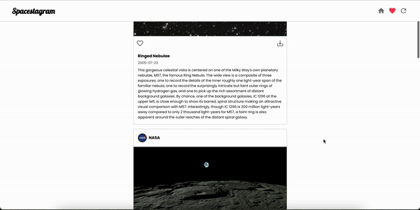
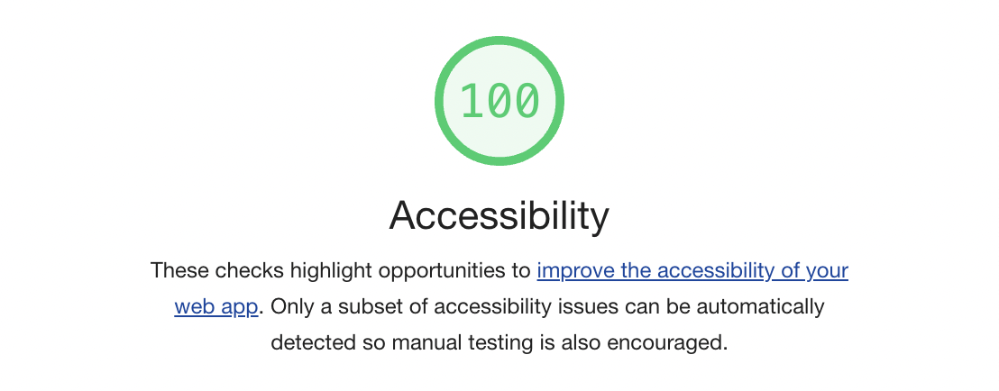

# Spacestagram

## Description
🪐 Spacestagram: Image-sharing from the final frontier. Shopify front-end developer intern challenge for summer 2022.

This web-app introduces a simple user interface which pulls images from NASA's Astronomy Picture of the Day (APOD) api, allowing the user to "like" and "unlike" their favourite images. Each image is stylized as a post with descriptive data such as: title, date, description and even generates a shareable link for the user.

### [Link](https://spacestagram-rkriar.netlify.app/)

## Built With
* [React](https://reactjs.org/)
* [axios](https://www.npmjs.com/package/axios)
* [MUI](https://mui.com/)
* [CopytoClipboard](https://www.npmjs.com/package/react-copy-to-clipboard)
* [APOD](https://api.nasa.gov/)

## Getting Started

To run the project locally, you can get a free api key at <https://api.nasa.gov/>

1. Clone this repo `git clone https://github.com/rkriar/spacestagram.git`
2. run `npm install`
3. Create a file at the root of the project named `.env`
4. Create a variable inside the `.env` file with the following name: `REACT_APP_API_KEY=<YOUR_API_KEY>` where you replace `<YOUR_API_KEY>` by the api key received from NASA
5. Run `npm start` to start the app on `http://localhost:3000`

## Accessibility
I used `alt` and `aria-label` tags for `img` and `button` elements used throughout the web-app. The HTML used is accessible and semantic, with `div` elements acting as containers. The elements inside the navbar and post objects can be tabbed through and are accessible via keyboard, displaying hover and focus states to the user. I used Lighthouse to check for remaining accessibility issues.

## Current Features
The current features include:
- Infinite scrolling
- Loading state when waiting for NASA's API to return data
- Instagram-like UI
- Random feed from APOD
- Like/unlike picture 
- Liked pictures are saved in local storage for user to view
- Error handling for api

### Loading State

### Error Handling

